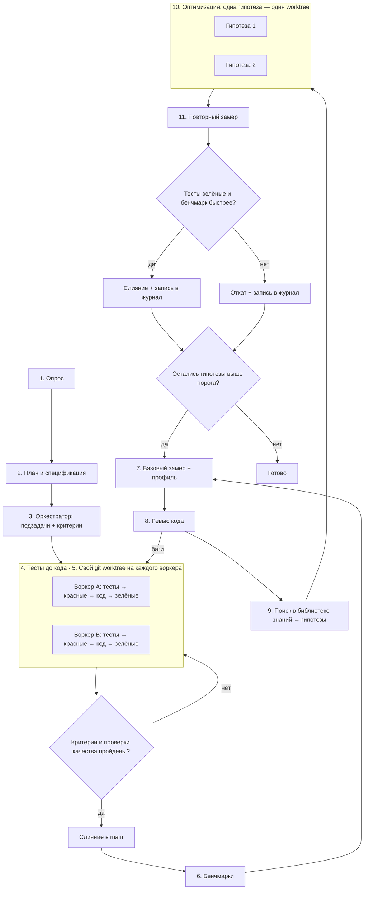

# Пайплайн разработки и оптимизации Rust-кода

Порядок работы над Rust-задачей: от постановки до кода с зелёными тестами, затем цикл оптимизации. В цикле код ускоряется только по замерам, а каждая правка опирается на источник из библиотеки знаний скилла. Пайплайн не зависит от предметной области и подходит для библиотек, CLI, сервисов, embedded, игр и данных.

- [Схема](#схема)
- [Роли и модели](#роли-и-модели)
- [Этапы](#этапы)
- [Обязательные проверки качества](#обязательные-проверки-качества)
- [Этап 6. Бенчмарки](#этап-6-бенчмарки)
- [Этап 7. Базовый замер и профиль](#этап-7-базовый-замер-и-профиль)
- [Этап 8. Ревью кода](#этап-8-ревью-кода)
- [Этап 9. Поиск в библиотеке знаний](#этап-9-поиск-в-библиотеке-знаний)
- [Этапы 10–11. Оптимизация и повторный замер](#этапы-1011-оптимизация-и-повторный-замер)
- [Короткий режим](#короткий-режим)
- [Почему так](#почему-так)

## Схема



## Роли и модели

Пайплайн рассчитан на агента с субагентами. Если субагентов нет, один агент проходит те же этапы последовательно, а вместо worktree использует отдельные ветки.

| Роль | Рекомендуемая модель | Этапы |
| --- | --- | --- |
| Оркестратор: опрос, план, распределение работы, ревью, поиск решений, приёмка | Старшая модель, например Claude Opus 5.5 | 1–3, приёмка, 8, 9, решение на 11 |
| Воркер: основной код, тесты, бенчмарки, оптимизации | Средняя модель, например Claude Sonnet 5.5 | 4, 6, 10 |
| Рутина: простые правки, прогоны команд, сбор цифр | Быстрая модель, например Claude Haiku 4.5 | 4 (рутина), 7, 11 (замер) |

Старшая модель только управляет и проверяет. Основной объём кода пишут более дешёвые модели.

## Этапы

| Этап | Что делает | Команда агенту |
| --- | --- | --- |
| 1. Опрос | Задаёт уточняющие вопросы: цель, ограничения, целевые платформы, MSRV, требования к скорости и памяти | «Прежде чем начать, задай мне вопросы по задаче» |
| 2. План и спецификация | Фиксирует план и спеку файлом. Отдельно перечисляет горячие пути и бюджет производительности: что и насколько должно быть быстрым | «Составь план и спецификацию, отдельно перечисли критичные по скорости места» |
| 3. Оркестратор | Делит план на независимые подзадачи с критериями приёмки. Архитектуру крейтов сверяет с [architecture.md](architecture.md) | «Разбей план на подзадачи с критериями готовности» |
| 4. Тесты до кода | Пишет тесты по спеке, видит красные, пишет код и чинит до зелёных | «Сначала тесты по спеке, запусти — должны быть красными. Потом код, пока все не зелёные» |
| 5. Изоляция | Отдельный git worktree на каждого воркера | «Работай в отдельном worktree, main не трогай» |
| Приёмка | Сверяет результат с критериями и [проверками качества](#обязательные-проверки-качества): слияние или возврат | «Проверь ветку по критериям и покажи вывод тестов и clippy» |
| 6. Бенчмарки | Пишет бенчмарки на горячие пути из спеки. После этапа они заморожены | «Напиши бенчмарки criterion на горячие пути из спеки» |
| 7. Базовый замер + профиль | Снимает базовую линию и профиль самого медленного бенчмарка | «Сохрани базовую линию и сними профиль самого медленного бенчмарка» |
| 8. Ревью кода | Стандартное ревью: баги, безопасность, идиоматичность, архитектура | «Сделай ревью: баги отдельно, замечания по скорости и дизайну отдельно» |
| 9. Поиск в библиотеке знаний | Сопоставляет профиль и замечания ревью с разделами справочников и пишет гипотезы | «По профилю и ревью найди решения в библиотеке знаний и оформи карточки гипотез» |
| 10. Оптимизация | Каждая гипотеза реализуется отдельно, тесты и бенчмарки не меняются | «Реализуй гипотезу N в отдельном worktree, тесты и бенчмарки не трогай» |
| 11. Повторный замер | Прогоняет бенчмарки против базовой линии, оркестратор решает: слить или откатить | «Сравни с базовой линией и покажи изменения по каждому бенчмарку» |

## Обязательные проверки качества

Перед любым слиянием в `main`, и на приёмке, и на этапе 11, ветка проходит минимальный набор проверок. Подробности по каждому инструменту — в [toolchain.md](toolchain.md).

```bash
cargo fmt --all --check
cargo clippy --workspace --all-targets --all-features -- -D warnings
cargo nextest run --workspace --all-features   # или cargo test, если nextest не установлен
cargo test --doc --workspace                   # nextest не запускает doctest
cargo deny check                               # лицензии, уязвимости, дубликаты; если настроен
```

По ситуации добавляются:

- `cargo +nightly miri test`, если в изменении есть `unsafe`;
- `cargo semver-checks`, если это публикуемая библиотека;
- проверка MSRV, если в `Cargo.toml` задан `rust-version`.

`-D warnings` уместен в CI и на приёмке, но не как `#![deny(warnings)]` в коде, потому что новая версия компилятора не должна ломать сборку у пользователей ([idioms-patterns.md](idioms-patterns.md), раздел «Антипаттерны»).

## Этап 6. Бенчмарки

- **Мерить то, что важно пользователю.** Горячие пути берутся из спеки, а не из догадок воркера. Это может быть парсинг входа, обработка запроса, шаг симуляции, сериализация, поиск.
- **Детерминизм.** Фиксированный seed у генераторов случайных чисел, одинаковые реалистичные входные данные, `std::hint::black_box` на входах и результатах, чтобы компилятор не выкинул вычисления.
- **Инструмент по умолчанию — criterion.** Он сохраняет базовую линию и сам говорит, значимо ли изменилась скорость. Бенчмарки лежат в `benches/`, а в `Cargo.toml` у каждого стоит `harness = false`.
- **Дополнительно:**
  - divan — лёгкий харнесс, который считает аллокации;
  - Gungraun (бывший iai-callgrind) — считает инструкции и почти не шумит в CI, но работает только на Linux и Intel macOS;
  - hyperfine — для замера CLI-программы целиком.
- **Бенчмарки замораживаются.** Как и тесты, они контракт. Если на этапе 10 бенчмарк изменится, сравнение с базовой линией потеряет смысл.

Обзор инструментов: [toolchain.md](toolchain.md) (раздел 6) и [performance.md](performance.md) (раздел «Профилирование и бенчмарки»).

## Этап 7. Базовый замер и профиль

```bash
cargo bench --bench <имя> -- --save-baseline before
```

`--bench <имя>` указывается явно, иначе аргументы criterion попадут в стандартный тестовый харнесс библиотеки, и он завершится с ошибкой.

- Базовая и повторная линии снимаются на одной машине, в одном профиле сборки, когда на машине не идёт другой тяжёлой работы. Шум между прогонами — главный источник ложных «ускорений».
- Профиль самого медленного бенчмарка снимается samply (Linux, macOS, Windows) или cargo-flamegraph. Для профиля в `Cargo.toml` нужен отдельный профиль сборки с `debug = true` (пример — в [performance.md](performance.md), раздел «Профили сборки»).
- Итог этапа — таблица: бенчмарк, время, топ горячих функций из профиля.
- Если ревью на этапе 8 нашло баги и код после исправления поменялся, базовую линию нужно снять заново.

## Этап 8. Ревью кода

Ревью идёт до оптимизаций, потому что ускорять имеет смысл уже правильный код.

- Чеклисты:
  - идиоматичный код — [idioms-patterns.md](idioms-patterns.md), раздел «Чеклист code review»;
  - конкурентный и unsafe-код — [concurrency-async-unsafe.md](concurrency-async-unsafe.md), раздел «Чеклист review»;
  - архитектура — [architecture.md](architecture.md), разделы «Направление зависимостей и слои» и «Ошибки по слоям».
- Находки делятся на две группы:
  - **баги** — неверное поведение, паника на корректном входе, гонки, UB, уязвимости. Возвращаются на этап 4 с тестом, который воспроизводит баг;
  - **можно сделать лучше** — скорость, дизайн, идиоматичность. Идут на вход этапа 9.

## Этап 9. Поиск в библиотеке знаний

Оркестратор идёт от симптома к справочнику. Главная точка входа — таблица «Симптом → техника → источник» в [performance.md](performance.md).

| Что видно в профиле или ревью | Куда смотреть |
| --- | --- |
| Много аллокаций, `clone()`, `String` в горячем цикле | [performance.md](performance.md) → «Память, аллокации и layout» |
| Циклы по индексам, проверки границ, числовые вычисления | [performance.md](performance.md) → «Итераторы, bounds checks и SIMD» |
| `HashMap` в горячем пути | [performance.md](performance.md) → «Хэширование» |
| Параллелизуемые циклы, медленный ввод-вывод | [performance.md](performance.md) → «Параллелизм и I/O» |
| Настройки релизной сборки, LTO, PGO, размер бинарника | [performance.md](performance.md) → «Профили сборки» |
| Медленная компиляция, долгие пересборки | [performance.md](performance.md) → «Скорость компиляции», [architecture.md](architecture.md) → «Разбиение на крейты и время сборки» |
| `Rc<RefCell>`, лишние `dyn`, неудобные границы типов, графы объектов | [idioms-patterns.md](idioms-patterns.md) → «Трейты и диспетчеризация», «Владение, мутабельность и графы» |
| Блокировки, каналы, async, `unsafe` | [concurrency-async-unsafe.md](concurrency-async-unsafe.md) |
| Проблема типична для домена (web, embedded, WASM, игры, данные…) | [domains.md](domains.md) → раздел домена |
| Нужен инструмент для диагностики | [toolchain.md](toolchain.md) |
| Нужно глубже разобраться в теме | [books.md](books.md) |

Результат этапа — список карточек гипотез, отсортированный по ожидаемому эффекту:

```
Гипотеза N: <что меняем>
Где: <файл и функция>
Почему: <горячее место из профиля или замечание ревью>
Источник: <ссылка из библиотеки знаний>
Ожидаемый эффект: <какой бенчмарк и насколько должен ускориться>
Риск: <что может сломаться, нужен ли unsafe>
```

Если в библиотеке нет решения под найденную проблему, это пишется в карточке прямо, без выдуманного решения. Такой пробел — повод дополнить библиотеку.

## Этапы 10–11. Оптимизация и повторный замер

Каждая гипотеза реализуется в своём worktree, чтобы эффект был виден отдельно. Затем:

```bash
cargo bench --bench <имя> -- --baseline before
```

Гипотеза сливается в `main`, только если выполнены все условия:

1. Все [проверки качества](#обязательные-проверки-качества) пройдены, тесты зелёные.
2. Целевой бенчмарк ускорился, criterion считает изменение значимым («Performance has improved»), а выигрыш не меньше порога из спеки. Порог по умолчанию — 5%.
3. Остальные бенчмарки не замедлились сверх шума.
4. Код не стал заметно хуже: оркестратор коротко проверяет правку, а у каждого нового `unsafe` есть комментарий `// SAFETY:`.

Иначе worktree удаляется. В обоих случаях результат записывается в журнал оптимизаций, например `docs/perf-log.md`:

| Гипотеза | Источник | До | После | Решение |
| --- | --- | --- | --- | --- |
| `HashMap` → `FxHashMap` в `parse_index` | ссылка из библиотеки | 1,82 мс | 1,41 мс | слита |

Журнал не даёт повторно проверять отклонённые идеи. Если гипотезы сливались, перед следующим кругом снимается новая базовая линия. Цикл 7–11 повторяется, пока остаются гипотезы с ожидаемым эффектом выше порога.

## Короткий режим

Для небольшой задачи (одна функция, один баг) весь пайплайн избыточен. Достаточно:

1. Тест, который воспроизводит задачу.
2. Код до зелёного теста.
3. [Проверки качества](#обязательные-проверки-качества).
4. Ревью по чеклисту из [idioms-patterns.md](idioms-patterns.md).

Цикл оптимизации запускается, только если в задаче есть требование к скорости или профиль показал проблему.

## Почему так

- **Тесты — это контракт.** Если тесты написаны до кода, агент не подгонит их под уже сделанное. Фраза «готово, всё работает» без зелёного прогона ничего не значит.
- **Бенчмарки — тоже контракт.** Их пишут до оптимизаций и не трогают, поэтому «стало быстрее» подтверждается цифрами против базовой линии, а не ощущением.
- **Сначала корректность, потом скорость.** Ревью стоит до оптимизаций, и ускорять приходится уже правильный код.
- **Решения берутся из источников.** Каждая гипотеза ссылается на книгу или статью из библиотеки. Это отсекает выдуманные «оптимизации» и сразу даёт материал для разбора.
- **Одна гипотеза — один worktree.** Эффект каждой правки виден отдельно, и неудачную легко откатить, не задев удачные.
- **Worktree защищает main.** Параллельные воркеры не мешают друг другу и не ломают основную ветку.
